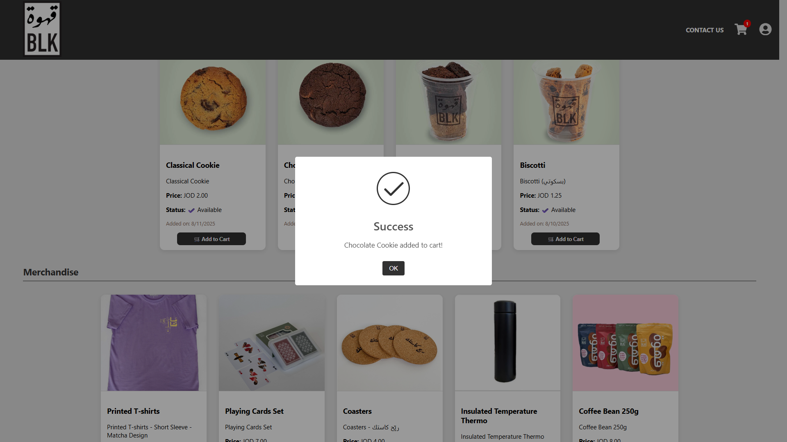

# ☕ BLK Coffee - Full Stack Web Application

## 📌 Overview
BLK Coffee is a full stack coffee shop management and ordering system, built with:
- **Backend:** Node.js, Express.js, PostgreSQL
- **Frontend:** React.js
- **Authentication:** JWT
- **File Uploads:** Multer
- **API Communication:** Axios

This system allows:
- User registration and login with role-based access (Admin/User)
- Admin dashboard for managing products and users
- User dashboard for browsing products, adding to cart, and placing orders
- Cart management with live quantity updates
- Image upload for products
- Secure API routes with token verification

---

## 🛠 Tech Stack

### Backend
- Node.js
- Express.js
- PostgreSQL
- JWT Authentication
- Multer (file uploads)
- CORS
- Dotenv for environment variables

### Frontend
- React.js
- React Router DOM
- Axios
- CSS for styling

---

## 📂 Project Structure

BLKProject/
├── server/           # Backend (Node.js + Express + PostgreSQL)
│   ├── routes/       # API routes
│   ├── middleware/   # Authentication middlewares
│   ├── uploads/      # Uploaded images
│   └── server.js     # Entry point
│
├── client/           # Frontend (React.js)
│   ├── src/
│   │   ├── pages/    # All pages (Login, Register, Dashboard, etc.)
│   │   ├── components/ # Navbar, ProtectedRoute, etc.
│   │   └── App.js
│
├── screenshots/      # Project screenshots
├── README.md

---

## ⚙️ Installation & Setup

### Clone the repository
```bash
git clone https://github.com/J33ar/BLK-Coffee-Project.git
cd BLK-Coffee

cd server
npm install

cd ../client
npm install
npm start

```

###  Create .evn

- PORT=5000
- DATABASE_URL=your_postgres_connection_url
- JWT_SECRET=your_jwt_secret

### The app should now be running on:

- Frontend: http://localhost:3000
- Backend: http://localhost:5000

### DB: create DB & tables
- Connect to psql and run:
```bash
sqlstart
psql
\c DB Name

CREATE DATABASE blk_coffee;

CREATE TABLE users (
  id SERIAL PRIMARY KEY,
  username VARCHAR(100),
  email VARCHAR(255) UNIQUE NOT NULL,
  password TEXT NOT NULL,
  role VARCHAR(20) DEFAULT 'user',
  profile_pic TEXT,
  created_at TIMESTAMP DEFAULT CURRENT_TIMESTAMP
);

CREATE TABLE products (
  id SERIAL PRIMARY KEY,
  name VARCHAR(255) NOT NULL,
  description TEXT,
  price NUMERIC(10,2),
  image_url TEXT,
  category VARCHAR(100),
  in_stock BOOLEAN DEFAULT TRUE,
  created_at TIMESTAMP DEFAULT CURRENT_TIMESTAMP
);

CREATE TABLE cart (
  id SERIAL PRIMARY KEY,
  user_id INT REFERENCES users(id) ON DELETE CASCADE,
  product_id INT REFERENCES products(id) ON DELETE CASCADE,
  quantity INT DEFAULT 1,
  created_at TIMESTAMP DEFAULT CURRENT_TIMESTAMP
);

```
---

## ✨ Features

### User
- User registration and login with JWT authentication.
- Browse products with images and prices.
- Add products to the shopping cart.
- View and manage cart items.

### Admin
- Login with admin credentials.
- Manage products (add, edit, delete).
- Manage users (view, delete).


---

## 📸 Screenshots

### 🔐 Authentication
**Login Page**


**Register Page**


---

### 🛍 User Features
**Product Listing - User Dashboard**


**Category**


**Search Product**


**Add To Cart But Out Of The Stock**


**Add To Cart**


**Cart Page**


**Profile User**


---

### 🛠 Admin Features
**Admin Dashboard**


**Product Management - Admin**


**Add Product**


**Manage Users**


**Profile Admin**


---

## 💡 Future Improvements
- Order tracking system.
- Payment gateway integration (PayPal Or Visa).
- Multi-language support.
- Add store locations everywhere.


